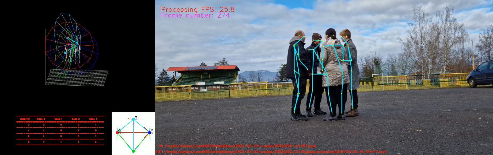

# Social Robotics Gaze Detection

## Todo
- [x] calculate gaze direction from 3D poses
- [ ] detect when people are looking at the camera
- [ ] determine which people are looking at each other (assumption is that they are probably at conversation, and the robot should not drive between them, but drive around)


## Acknowledgements
Real-time 3D Multi-person Pose Estimation is based on https://github.com/Daniil-Osokin/lightweight-human-pose-estimation-3d-demo.pytorch/tree/master

This repository contains 3D multi-person pose estimation demo in PyTorch. Intel OpenVINO&trade; backend can be used for fast inference on CPU. This demo is based on [Lightweight OpenPose](https://arxiv.org/pdf/1811.12004.pdf) and [Single-Shot Multi-Person 3D Pose Estimation From Monocular RGB](https://arxiv.org/pdf/1712.03453.pdf) papers. It detects 2D coordinates of up to 18 types of keypoints: ears, eyes, nose, neck, shoulders, elbows, wrists, hips, knees, and ankles, as well as their 3D coordinates. It was trained on [MS COCO](http://cocodataset.org/#home) and [CMU Panoptic](http://domedb.perception.cs.cmu.edu/) datasets and achieves 100 mm MPJPE (mean per joint position error) on CMU Panoptic subset. *This repository significantly overlaps with https://github.com/opencv/open_model_zoo/, however contains just the necessary code for 3D human pose estimation demo.*

<p align="center">
  
</p>

> The major part of the 3D-multi person pose estimation work was done by [Mariia Ageeva](https://github.com/marrmar)

## Table of Contents

* [Requirements](#requirements)
* [Prerequisites](#prerequisites)
* [Pre-trained model](#pre-trained-model)
* [Running](#running)
* [Inference with OpenVINO](#inference-openvino)
* [Inference with TensorRT](#inference-tensorrt)

## Requirements
* Python 3.5 (or above)
* CMake 3.10 (or above)
* C++ Compiler (g++ or MSVC)
* OpenCV 4.0 (or above)

> [Optional] [Intel OpenVINO](https://software.intel.com/en-us/openvino-toolkit) for fast inference on CPU.
> [Optional] [NVIDIA TensorRT](https://docs.nvidia.com/deeplearning/tensorrt/install-guide/index.html) for fast inference on Jetson.

## Prerequisites
1. Install virtual environment package:
```
sudo apt install python3-virtualenv
```
2. Create virtual environment:
```
virtualenv -p python3 myvenv
```
3. Activate virtual environment:
```
source  myvenv/bin/activate

```
4. Install requirements:
```
pip install -r requirements.txt

```
5. Install OpenCV 4 for C++ (script clones opencv repo and builds):
```
bash opencv/install_cpp_opencv.sh
```
6. Build `pose_extractor` module:
```
python setup.py build_ext
```
7. Add build folder to `PYTHONPATH`:
```
export PYTHONPATH=pose_extractor/build/:$PYTHONPATH
```

## Pre-trained model <a name="pre-trained-model"/>

Pre-trained model is available at [Google Drive](https://drive.google.com/file/d/1niBUbUecPhKt3GyeDNukobL4OQ3jqssH/view?usp=sharing).

Get it by running:
```
wget -O human-pose-estimation-3d.pth "https://drive.google.com/uc?export=download&id=1niBUbUecPhKt3GyeDNukobL4OQ3jqssH"

```

## Running

To run the demo, pass path to the pre-trained checkpoint and camera id (or path to video file):
```
python demo.py --model human-pose-estimation-3d.pth --video 0
```
For video files, use
```
python demo.py --model human-pose-estimation-3d.pth --video /path/to/video.mp4
```

> Camera can capture scene under different view angles, so for correct scene visualization, please pass camera extrinsics and focal length with `--extrinsics` and `--fx` options correspondingly (extrinsics sample format can be found in data folder). In case no camera parameters provided, demo will use the default ones.

## Inference with OpenVINO <a name="inference-openvino"/> (not being able to make it run at the moment)

To run with OpenVINO, it is necessary to convert checkpoint to OpenVINO format:

1. Install OpenVINO (in virtualenv)
```
pip install openvino-dev[pytorch,ONNX]==2022.3.0
```

2. Set OpenVINO environment variables (only needed when built from source):
```
source <OpenVINO_INSTALL_DIR>/bin/setupvars.sh
```

3. Convert checkpoint to ONNX:
```
python scripts/convert_to_onnx.py --checkpoint-path human-pose-estimation-3d.pth
```

3. Convert to OpenVINO format:
```
python myvenv/lib/python3.10/site-packages/openvino/tools/mo/mo.py --input_model human-pose-estimation-3d.onnx --input=data --mean_values=data[128.0,128.0,128.0] --scale_values=data[255.0,255.0,255.0] --output=features,heatmaps,pafs
```
In case OpenVINO is built from source:
```
python <OpenVINO_INSTALL_DIR>/deployment_tools/model_optimizer/mo.py --input_model human-pose-estimation-3d.onnx --input=data --mean_values=data[128.0,128.0,128.0] --scale_values=data[255.0,255.0,255.0] --output=features,heatmaps,pafs
```

To run the demo with OpenVINO inference, pass `--use-openvino` option and specify device to infer on:
```
python demo.py --model human-pose-estimation-3d.xml --device CPU --use-openvino --video 0
```

## Inference with TensorRT <a name="inference-tensorrt"/> (not being able to make it run at the moment)

To run with TensorRT, it is necessary to install it properly. Please, follow the [official guide](https://docs.nvidia.com/deeplearning/tensorrt/install-guide/index.html), these steps work for me:
1. [Install](https://developer.nvidia.com/cuda-downloads) CUDA 11.1.
2. [Install](https://developer.nvidia.com/cudnn) cuDNN 8 (runtime library, then developer).
3. Install `nvidia-tensorrt`:
    ```
    python -m pip install nvidia-pyindex
    pip install nvidia-tensorrt==7.2.1.6
    ```
4. [Install](https://github.com/NVIDIA-AI-IOT/torch2trt) `torch2trt`.

Convert checkpoint to TensorRT format:
```
python scripts/convert_to_trt.py --checkpoint-path human-pose-estimation-3d.pth
```
> TensorRT does not support dynamic network input size reshape.
  Make sure you have set proper network input height, width with `--height` and `--width` options during conversion (if not, there will be no detections).
  Default values work for a usual video with 16:9 aspect ratio (1280x720, 1920x1080).
  You can check the network input size with `print(scaled_img.shape)` in the demo.py

To run the demo with TensorRT inference, pass `--use-tensorrt` option:
```
python demo.py --model human-pose-estimation-3d-trt.pth --use-tensorrt --video 0
```

Author of https://github.com/Daniil-Osokin/lightweight-human-pose-estimation-3d-demo.pytorch/tree/master has observed ~10x network inference speedup on RTX 2060 (in comparison with default PyTorch 1.6.0+cu101 inference).
